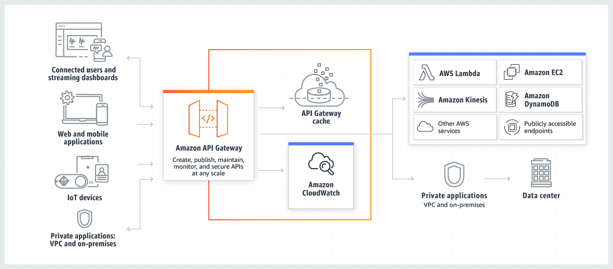

### What is API gateway?
- Stateless : Rest and HTTP APIs
  - http : lightweight with limited feauture
  - rest : more feature with fine grained control
- Stateful : Websocket APIs

#### Architecture

